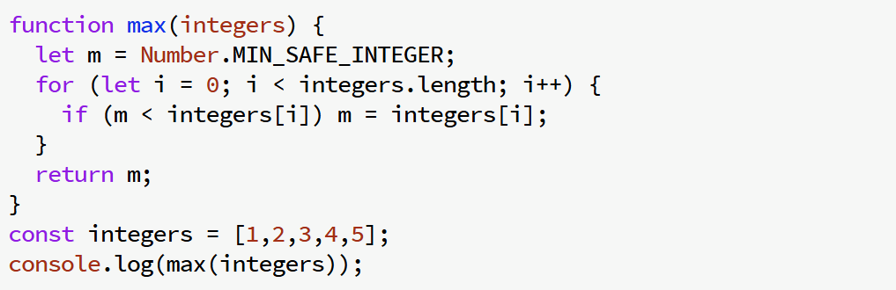
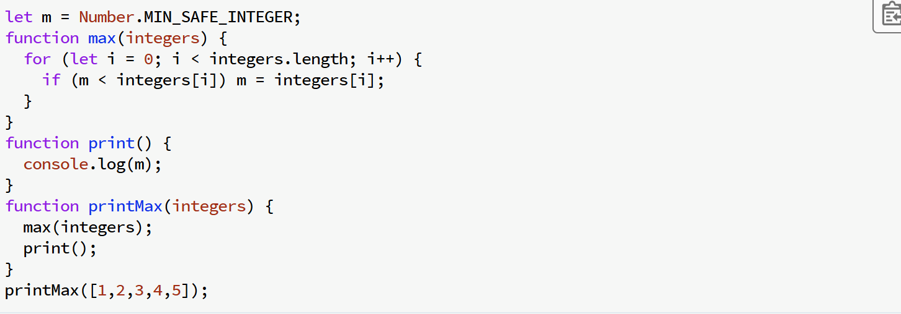
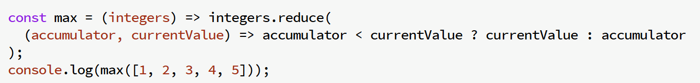
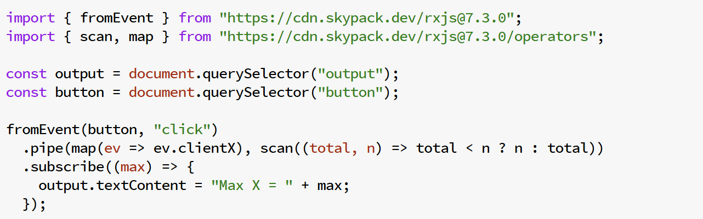

# TEMA 1
El objetivo de este documento es, además de cumplir con las entregas de clase, que sirva de guía de estudio para la alumna. A lo largo de este se explican los diferentes paradigmas de la programación, proporcionando capturas de los ejemplos de clase y ejemplos propios subidos al github. 
## Paradigmas de la programación
Son una manera de clasificar los lenguajes de programación en función de:
•	Cómo se ejecutan
•	Cómo se organiza el código
•	Estilo de programación
Un mismo lenguaje o código puede ser multiparadigma, en parte gracias a sus librerías
### Estructurada
La programación estructurada es un paradigma que organiza el código en bloques o estructuras controladas (como secuencias, decisiones y bucles), promoviendo claridad, legibilidad y una ejecución lógica lineal sin depender de saltos como el uso excesivo de goto.

_Ejemplo proporcionado en los apuntes_
Ejemplo propio
[Ejecuta el script](/estructurada.py)

### Imperativa
Este paradigma se centra en cómo debemos ejecutar. Se enfoca en el uso de instrucciones secuenciales que cambian el estado del programa paso a paso. Existen dos tipos, explicados a continuación.
#### Procedural
Es una extensión del paradigma imperativo que organiza el código en procedimientos o funciones reutilizables.

_uso de una función como ejemplo de procedural_
#### Orientada a objetos
En este paradigma, se modelan los problemas como objetos que tienen propiedades (atributos) y comportamientos (métodos).

_uso de una función como ejemplo de orientada a objetos_
### Declarativa
El paradigma declarativo se centra en qué se quiere lograr. En este enfoque, describes el resultado deseado y dejas que el lenguaje o el entorno se encargue de los detalles de ejecución.
#### Funcional
Trata las computaciones como evaluaciones de funciones matemáticas. Evita cambiar el estado y el uso de variables mutables, prefiriendo trabajar con funciones puras (que siempre devuelven el mismo resultado para los mismos parámetros). Este enfoque promueve la composición de funciones y reduce errores al eliminar efectos secundarios.

#### Reactiva
El paradigma reactivo se basa en reaccionar a eventos o cambios en el estado de forma asincrónica y fluida. El paradigma reactivo se usa en sistemas de interfaces modernas y aplicaciones web interactivas, como en React o Angular.
